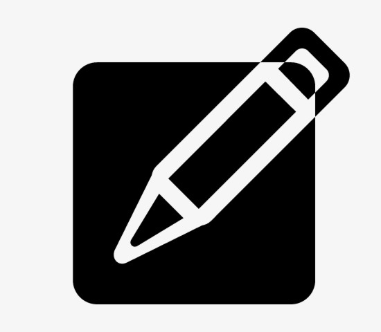

<!--
*** Thanks for checking out the Best-README-Template. If you have a suggestion
*** that would make this better, please fork the repo and create a pull request
*** or simply open an issue with the tag "enhancement".
*** Thanks again! Now go create something AMAZING! :D
-->


<!-- PROJECT SHIELDS -->
<!--
*** I'm using markdown "reference style" links for readability.
*** Reference links are enclosed in brackets [ ] instead of parentheses ( ).
*** See the bottom of this document for the declaration of the reference variables
*** for contributors-url, forks-url, etc. This is an optional, concise syntax you may use.
*** https://www.markdownguide.org/basic-syntax/#reference-style-links
-->

[![https://www.linkedin.com/in/jay-vinay/][linkedin-shield]][linkedin-url]


<!-- PROJECT LOGO -->
<br />
<p align="center">
  <a href="https://github.com/othneildrew/Best-README-Template">
    
  </a>

  <h3 align="center">JayPortable-Sudoku-Solver-Software-tool</h3>

  <p align="center">
This Application tool solves any Level Suduko puzzle
    <br />
    <a href="https://jay-sudoku-solver.netlify.app/"><strong>Made with ♥ by Jay
 »</strong></a>
    
  </p>
</p>


<!-- TABLE OF CONTENTS -->
<details open="open">
  <summary>Table of Contents</summary>
  <ol>
    <li>
      <a href="#about-the-project">About The Project</a>
      <ul>
        <li><a href="#built-with">Built With</a></li>
      </ul>
    </li>
    <li>
      <a href="#getting-started">Getting Started</a>
      <ul>
        <li><a href="#installation">Installation</a></li>
      </ul>
    </li>
    <li><a href="#usage">Usage</a></li>
    <li><a href="#contributing">Developed by</a></li>
    <li><a href="#contact">Contact</a></li>

  </ol>
</details>


<!-- ABOUT THE PROJECT -->
## About The Project

[![Product Name Screen Shot][product-screenshot]](https://example.com)


### Made as simple Graphical User Interface to make the Ui Easily to understandable
### Built With (Tools)

* [Tkinker](https://en.wikipedia.org/wiki/Tkinter)
* [Pytoexe](https://github.com/brentvollebregt/auto-py-to-exe)


<!-- GETTING STARTED -->
## Getting Started
### User Input Functionality
Input your chosen Sudoku puzzle into the cells of the window. Leave any empty cells blank. Then simply click "solve" to complete the puzzle or "clear" to clear the puzzle.
Simple Interface

### Installation

1. Extract the zip file and open the complete Directory in IDE (Pycharm prefered)
or
2. Clone the repo
   ```sh
   gh repo clone NamgiriJayVinay/JayPortable-Sudoku-Solver-Software-tool
   ```
3. run the python file
   ```py
   python sudoku_gui_code.py
   ```
   or 
## Simply Download the .exe from the Landing Page mentioned at the bottom 


<!-- USAGE EXAMPLES -->
## Usage

Simple Graphical User Interface to Solve Sudoku from the manual keyboard Input


<!-- CONTRIBUTING -->

## Developed by
    Jay Vinay Namgiri


<!-- CONTACT -->
## Contact

Jay - [@https://www.linkedin.com/in/jay-vinay/](https://www.linkedin.com/in/jay-vinay/)

My Website - [https://www.jayvinay.com/](https://www.jayvinay.com/)


Project  Landing Page: [https://jay-sudoku-solver.netlify.app/](https://jay-sudoku-solver.netlify.app/)

Project  Source code Link: [https://github.com/NamgiriJayVinay/JayPortable-Sudoku-Solver-Software-tool](https://github.com/NamgiriJayVinay/JayPortable-Sudoku-Solver-Software-tool)


<!-- MARKDOWN LINKS & IMAGES -->
<!-- https://www.markdownguide.org/basic-syntax/#reference-style-links -->
[contributors-shield]: https://img.shields.io/github/contributors/othneildrew/Best-README-Template.svg?style=for-the-badge
[contributors-url]: https://www.jayvinay.com/

[linkedin-shield]: https://img.shields.io/badge/-LinkedIn-black.svg?style=for-the-badge&logo=linkedin&colorB=555
[linkedin-url]: https://www.linkedin.com/in/jay-vinay/
[product-screenshot]: sudokuthumb.jpg
